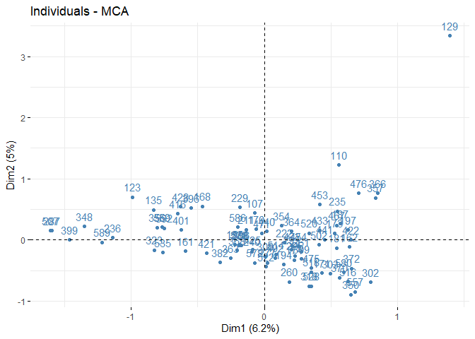

# assign-6


Loading needed libraries:

``` r
library(FactoMineR)
library(factoextra)
```

    ## Loading required package: ggplot2

    ## Welcome! Related Books: `Practical Guide To Cluster Analysis in R` at https://goo.gl/13EFCZ

``` r
library(ggpubr)
```

    ## Loading required package: magrittr

``` r
prodrat = read.csv("C:/Users/fb8502oa/Desktop/DSCI 415/DSCI 415 fall/ProductRatings.csv", header=TRUE)
names(prodrat)
```

    ##  [1] "QN"     "PROD1"  "PROD2"  "PROD3"  "PROD4"  "PROD5"  "PROD6" 
    ##  [8] "PROD7"  "PROD8"  "PROD9"  "PROD10" "PROD11" "PROD12" "PROD13"
    ## [15] "PROD14" "PROD15" "PROD16" "PROD17" "PROD18" "PROD19" "PROD20"
    ## [22] "PROD21" "PROD22"

``` r
row.names(prodrat) = prodrat$QN
prod.mat = prodrat[,-1]
prod.mat = apply(prod.mat,2,as.factor)
```

``` r
#doing the mca
prod.MCA = MCA(prod.mat, graph = FALSE)
summary(prod.MCA)
```

    ## 
    ## Call:
    ## MCA(X = prod.mat, graph = FALSE) 
    ## 
    ## 
    ## Eigenvalues
    ##                        Dim.1   Dim.2   Dim.3   Dim.4   Dim.5   Dim.6
    ## Variance               0.369   0.297   0.256   0.252   0.231   0.207
    ## % of var.              6.242   5.020   4.331   4.257   3.902   3.504
    ## Cumulative % of var.   6.242  11.262  15.594  19.850  23.752  27.256
    ##                        Dim.7   Dim.8   Dim.9  Dim.10  Dim.11  Dim.12
    ## Variance               0.197   0.193   0.186   0.176   0.167   0.156
    ## % of var.              3.329   3.266   3.155   2.984   2.829   2.638
    ## Cumulative % of var.  30.585  33.851  37.006  39.991  42.820  45.457
    ##                       Dim.13  Dim.14  Dim.15  Dim.16  Dim.17  Dim.18
    ## Variance               0.151   0.144   0.133   0.129   0.127   0.119
    ## % of var.              2.560   2.432   2.244   2.184   2.152   2.008
    ## Cumulative % of var.  48.017  50.450  52.693  54.878  57.030  59.038
    ##                       Dim.19  Dim.20  Dim.21  Dim.22  Dim.23  Dim.24
    ## Variance               0.114   0.109   0.105   0.103   0.098   0.097
    ## % of var.              1.937   1.839   1.777   1.746   1.656   1.636
    ## Cumulative % of var.  60.976  62.814  64.591  66.337  67.993  69.629
    ##                       Dim.25  Dim.26  Dim.27  Dim.28  Dim.29  Dim.30
    ## Variance               0.089   0.088   0.088   0.081   0.079   0.075
    ## % of var.              1.510   1.490   1.482   1.379   1.340   1.276
    ## Cumulative % of var.  71.139  72.629  74.111  75.490  76.830  78.106
    ##                       Dim.31  Dim.32  Dim.33  Dim.34  Dim.35  Dim.36
    ## Variance               0.071   0.067   0.065   0.060   0.059   0.056
    ## % of var.              1.199   1.133   1.094   1.013   1.003   0.943
    ## Cumulative % of var.  79.305  80.438  81.532  82.545  83.548  84.492
    ##                       Dim.37  Dim.38  Dim.39  Dim.40  Dim.41  Dim.42
    ## Variance               0.054   0.050   0.048   0.046   0.046   0.043
    ## % of var.              0.913   0.843   0.819   0.774   0.772   0.735
    ## Cumulative % of var.  85.405  86.248  87.067  87.841  88.613  89.348
    ##                       Dim.43  Dim.44  Dim.45  Dim.46  Dim.47  Dim.48
    ## Variance               0.041   0.041   0.038   0.036   0.034   0.032
    ## % of var.              0.701   0.692   0.648   0.606   0.568   0.547
    ## Cumulative % of var.  90.049  90.741  91.389  91.995  92.563  93.111
    ##                       Dim.49  Dim.50  Dim.51  Dim.52  Dim.53  Dim.54
    ## Variance               0.031   0.029   0.027   0.025   0.024   0.022
    ## % of var.              0.519   0.497   0.452   0.416   0.411   0.380
    ## Cumulative % of var.  93.630  94.127  94.579  94.995  95.405  95.786
    ##                       Dim.55  Dim.56  Dim.57  Dim.58  Dim.59  Dim.60
    ## Variance               0.020   0.020   0.018   0.017   0.016   0.015
    ## % of var.              0.343   0.331   0.307   0.293   0.279   0.260
    ## Cumulative % of var.  96.129  96.460  96.767  97.060  97.339  97.598
    ##                       Dim.61  Dim.62  Dim.63  Dim.64  Dim.65  Dim.66
    ## Variance               0.014   0.013   0.012   0.010   0.010   0.009
    ## % of var.              0.242   0.214   0.199   0.173   0.166   0.153
    ## Cumulative % of var.  97.840  98.054  98.253  98.426  98.592  98.746
    ##                       Dim.67  Dim.68  Dim.69  Dim.70  Dim.71  Dim.72
    ## Variance               0.008   0.008   0.008   0.006   0.006   0.005
    ## % of var.              0.143   0.141   0.136   0.106   0.101   0.091
    ## Cumulative % of var.  98.889  99.030  99.165  99.272  99.372  99.464
    ##                       Dim.73  Dim.74  Dim.75  Dim.76  Dim.77  Dim.78
    ## Variance               0.004   0.004   0.004   0.004   0.003   0.003
    ## % of var.              0.071   0.068   0.061   0.060   0.051   0.043
    ## Cumulative % of var.  99.534  99.602  99.664  99.724  99.775  99.818
    ##                       Dim.79  Dim.80  Dim.81  Dim.82  Dim.83  Dim.84
    ## Variance               0.002   0.002   0.002   0.002   0.001   0.001
    ## % of var.              0.039   0.035   0.030   0.027   0.021   0.017
    ## Cumulative % of var.  99.857  99.892  99.922  99.949  99.971  99.987
    ##                       Dim.85
    ## Variance               0.001
    ## % of var.              0.013
    ## Cumulative % of var. 100.000
    ## 
    ## Individuals (the 10 first)
    ##            Dim.1    ctr   cos2    Dim.2    ctr   cos2    Dim.3    ctr
    ## 107     | -0.071  0.016  0.001 |  0.439  0.756  0.036 | -0.260  0.308
    ## 110     |  0.559  0.985  0.028 |  1.225  5.885  0.136 |  0.415  0.781
    ## 123     | -0.991  3.095  0.116 |  0.702  1.933  0.058 | -0.537  1.309
    ## 129     |  1.395  6.136  0.102 |  3.336 43.625  0.582 | -0.120  0.066
    ## 135     | -0.830  2.173  0.142 |  0.494  0.957  0.050 |  0.050  0.011
    ## 155     | -0.221  0.154  0.010 | -0.075  0.022  0.001 | -0.538  1.316
    ## 161     | -0.595  1.115  0.113 | -0.184  0.132  0.011 | -0.479  1.040
    ## 162     |  0.643  1.303  0.076 | -0.114  0.051  0.002 | -0.406  0.749
    ## 168     | -0.464  0.679  0.041 |  0.551  1.188  0.058 | -0.318  0.460
    ## 170     | -0.061  0.012  0.001 |  0.174  0.119  0.005 | -0.289  0.379
    ##           cos2  
    ## 107      0.013 |
    ## 110      0.016 |
    ## 123      0.034 |
    ## 129      0.001 |
    ## 135      0.001 |
    ## 155      0.057 |
    ## 161      0.073 |
    ## 162      0.030 |
    ## 168      0.019 |
    ## 170      0.015 |
    ## 
    ## Categories (the 10 first)
    ##            Dim.1    ctr   cos2 v.test    Dim.2    ctr   cos2 v.test  
    ## PROD1_2 | -0.852  0.312  0.026 -1.493 | -0.268  0.038  0.003 -0.470 |
    ## PROD1_3 | -0.832  0.595  0.052 -2.100 | -0.345  0.127  0.009 -0.870 |
    ## PROD1_4 | -0.909  0.946  0.085 -2.683 | -0.279  0.111  0.008 -0.825 |
    ## PROD1_5 |  0.042  0.004  0.000  0.178 | -0.032  0.003  0.000 -0.136 |
    ## PROD1_6 |  0.233  0.226  0.028  1.533 | -0.155  0.124  0.012 -1.020 |
    ## PROD1_7 |  0.297  0.316  0.036  1.753 |  0.403  0.725  0.067  2.381 |
    ## PROD2_1 | -0.298  0.025  0.002 -0.424 | -0.145  0.008  0.001 -0.207 |
    ## PROD2_2 | -0.154  0.003  0.000 -0.154 | -0.349  0.022  0.001 -0.349 |
    ## PROD2_3 | -0.017  0.000  0.000 -0.047 | -0.443  0.244  0.017 -1.215 |
    ## PROD2_4 | -0.875  0.548  0.047 -2.004 | -0.307  0.084  0.006 -0.704 |
    ##          Dim.3    ctr   cos2 v.test  
    ## PROD1_2 -0.425  0.112  0.007 -0.746 |
    ## PROD1_3  0.976  1.180  0.071  2.464 |
    ## PROD1_4  0.832  1.144  0.071  2.457 |
    ## PROD1_5  0.028  0.002  0.000  0.119 |
    ## PROD1_6 -0.225  0.304  0.026 -1.481 |
    ## PROD1_7 -0.205  0.217  0.017 -1.210 |
    ## PROD2_1  5.173 11.052  0.637  7.359 |
    ## PROD2_2  0.148  0.004  0.000  0.148 |
    ## PROD2_3  0.146  0.031  0.002  0.402 |
    ## PROD2_4  0.489  0.247  0.015  1.121 |
    ## 
    ## Categorical variables (eta2)
    ##           Dim.1 Dim.2 Dim.3  
    ## PROD1   | 0.195 0.074 0.167 |
    ## PROD2   | 0.167 0.211 0.674 |
    ## PROD3   | 0.573 0.183 0.258 |
    ## PROD4   | 0.345 0.033 0.342 |
    ## PROD5   | 0.610 0.626 0.066 |
    ## PROD6   | 0.369 0.475 0.405 |
    ## PROD7   | 0.627 0.389 0.235 |
    ## PROD8   | 0.562 0.396 0.075 |
    ## PROD9   | 0.258 0.148 0.245 |
    ## PROD10  | 0.442 0.413 0.138 |

``` r
#ploting the individual 
fviz_mca_ind(prod.MCA, col.ind = "steelblue") 
```



``` r
#outliyer = indv 129
```

analysis blah blha blah
