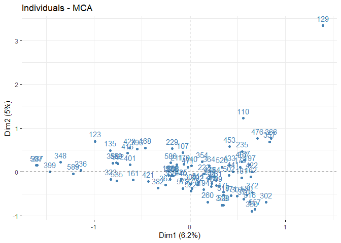
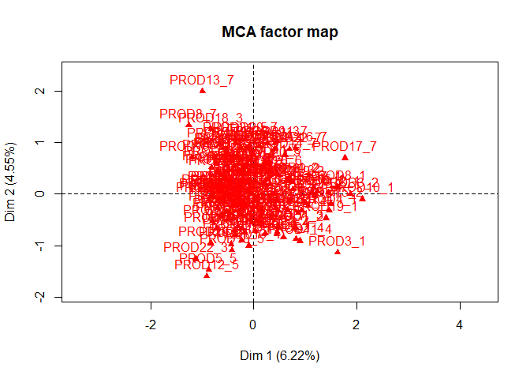
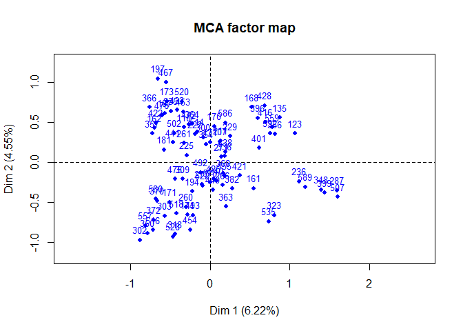
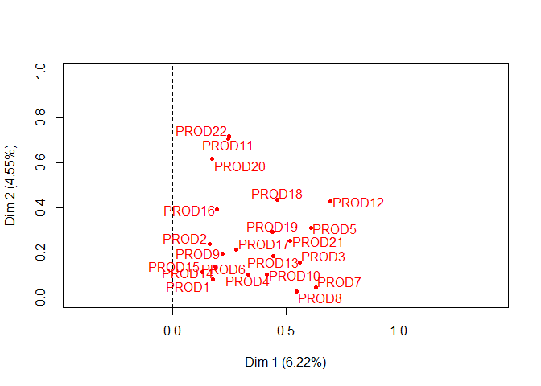
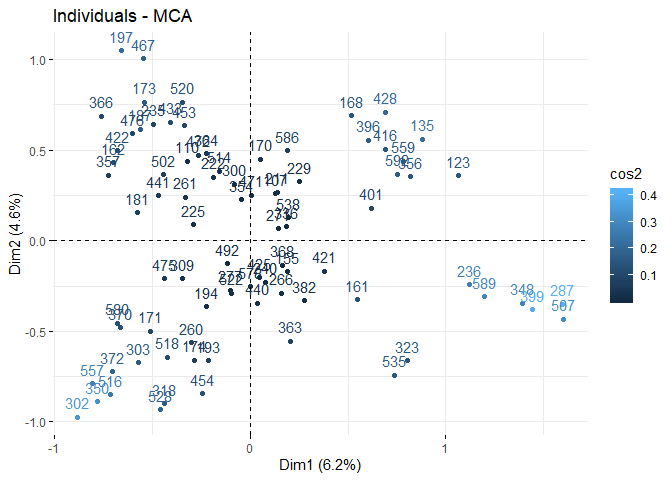
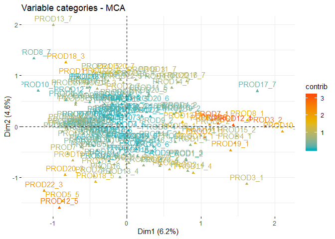
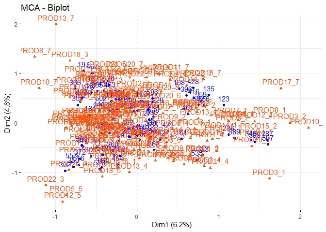
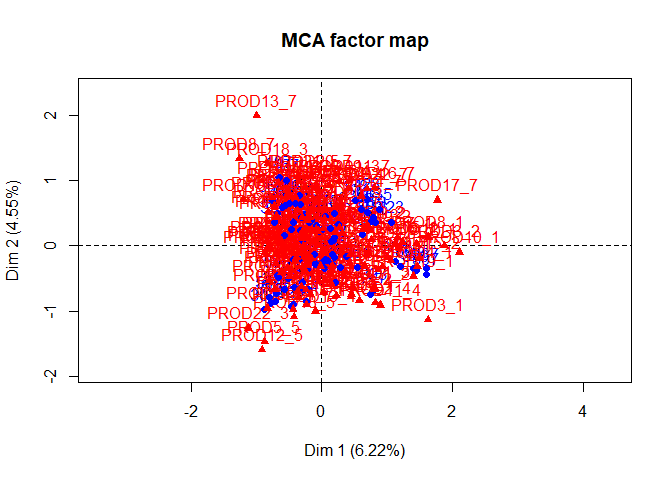

Loading needed libraries:

``` r
library(FactoMineR)
library(factoextra)
```

    ## Loading required package: ggplot2

    ## Warning: package 'ggplot2' was built under R version 3.6.2

    ## Welcome! Related Books: `Practical Guide To Cluster Analysis in R` at https://goo.gl/13EFCZ

``` r
library(ggpubr)
```

    ## Loading required package: magrittr

Use multiple correspondence analysis (MCA) to explain the variability
between these potential customers in terms of the product likes and
dislikes. When you look at a plot of the individuals one of them will
really standout. You have just identified an extreme outlier in these
data! Look at the profile of ratings for this person using the View()
command in R to view of spreadsheet of these data. Can you see anything
unique about this individual? What is it?

``` r
prodrat = read.csv("C:/Users/fb8502oa/Desktop/DSCI 415/DSCI 415 fall/ProductRatings.csv", header=TRUE)
names(prodrat)
```

    ##  [1] "QN"     "PROD1"  "PROD2"  "PROD3"  "PROD4"  "PROD5"  "PROD6" 
    ##  [8] "PROD7"  "PROD8"  "PROD9"  "PROD10" "PROD11" "PROD12" "PROD13"
    ## [15] "PROD14" "PROD15" "PROD16" "PROD17" "PROD18" "PROD19" "PROD20"
    ## [22] "PROD21" "PROD22"

``` r
row.names(prodrat) = prodrat$QN
prod.mat = prodrat[,-1]
prod.mat = apply(prod.mat,2,as.factor)
```

``` r
#doing the mca
prod.MCA = MCA(prod.mat, graph = FALSE)
summary(prod.MCA)
```

    ## 
    ## Call:
    ## MCA(X = prod.mat, graph = FALSE) 
    ## 
    ## 
    ## Eigenvalues
    ##                        Dim.1   Dim.2   Dim.3   Dim.4   Dim.5   Dim.6
    ## Variance               0.369   0.297   0.256   0.252   0.231   0.207
    ## % of var.              6.242   5.020   4.331   4.257   3.902   3.504
    ## Cumulative % of var.   6.242  11.262  15.594  19.850  23.752  27.256
    ##                        Dim.7   Dim.8   Dim.9  Dim.10  Dim.11  Dim.12
    ## Variance               0.197   0.193   0.186   0.176   0.167   0.156
    ## % of var.              3.329   3.266   3.155   2.984   2.829   2.638
    ## Cumulative % of var.  30.585  33.851  37.006  39.991  42.820  45.457
    ##                       Dim.13  Dim.14  Dim.15  Dim.16  Dim.17  Dim.18
    ## Variance               0.151   0.144   0.133   0.129   0.127   0.119
    ## % of var.              2.560   2.432   2.244   2.184   2.152   2.008
    ## Cumulative % of var.  48.017  50.450  52.693  54.878  57.030  59.038
    ##                       Dim.19  Dim.20  Dim.21  Dim.22  Dim.23  Dim.24
    ## Variance               0.114   0.109   0.105   0.103   0.098   0.097
    ## % of var.              1.937   1.839   1.777   1.746   1.656   1.636
    ## Cumulative % of var.  60.976  62.814  64.591  66.337  67.993  69.629
    ##                       Dim.25  Dim.26  Dim.27  Dim.28  Dim.29  Dim.30
    ## Variance               0.089   0.088   0.088   0.081   0.079   0.075
    ## % of var.              1.510   1.490   1.482   1.379   1.340   1.276
    ## Cumulative % of var.  71.139  72.629  74.111  75.490  76.830  78.106
    ##                       Dim.31  Dim.32  Dim.33  Dim.34  Dim.35  Dim.36
    ## Variance               0.071   0.067   0.065   0.060   0.059   0.056
    ## % of var.              1.199   1.133   1.094   1.013   1.003   0.943
    ## Cumulative % of var.  79.305  80.438  81.532  82.545  83.548  84.492
    ##                       Dim.37  Dim.38  Dim.39  Dim.40  Dim.41  Dim.42
    ## Variance               0.054   0.050   0.048   0.046   0.046   0.043
    ## % of var.              0.913   0.843   0.819   0.774   0.772   0.735
    ## Cumulative % of var.  85.405  86.248  87.067  87.841  88.613  89.348
    ##                       Dim.43  Dim.44  Dim.45  Dim.46  Dim.47  Dim.48
    ## Variance               0.041   0.041   0.038   0.036   0.034   0.032
    ## % of var.              0.701   0.692   0.648   0.606   0.568   0.547
    ## Cumulative % of var.  90.049  90.741  91.389  91.995  92.563  93.111
    ##                       Dim.49  Dim.50  Dim.51  Dim.52  Dim.53  Dim.54
    ## Variance               0.031   0.029   0.027   0.025   0.024   0.022
    ## % of var.              0.519   0.497   0.452   0.416   0.411   0.380
    ## Cumulative % of var.  93.630  94.127  94.579  94.995  95.405  95.786
    ##                       Dim.55  Dim.56  Dim.57  Dim.58  Dim.59  Dim.60
    ## Variance               0.020   0.020   0.018   0.017   0.016   0.015
    ## % of var.              0.343   0.331   0.307   0.293   0.279   0.260
    ## Cumulative % of var.  96.129  96.460  96.767  97.060  97.339  97.598
    ##                       Dim.61  Dim.62  Dim.63  Dim.64  Dim.65  Dim.66
    ## Variance               0.014   0.013   0.012   0.010   0.010   0.009
    ## % of var.              0.242   0.214   0.199   0.173   0.166   0.153
    ## Cumulative % of var.  97.840  98.054  98.253  98.426  98.592  98.746
    ##                       Dim.67  Dim.68  Dim.69  Dim.70  Dim.71  Dim.72
    ## Variance               0.008   0.008   0.008   0.006   0.006   0.005
    ## % of var.              0.143   0.141   0.136   0.106   0.101   0.091
    ## Cumulative % of var.  98.889  99.030  99.165  99.272  99.372  99.464
    ##                       Dim.73  Dim.74  Dim.75  Dim.76  Dim.77  Dim.78
    ## Variance               0.004   0.004   0.004   0.004   0.003   0.003
    ## % of var.              0.071   0.068   0.061   0.060   0.051   0.043
    ## Cumulative % of var.  99.534  99.602  99.664  99.724  99.775  99.818
    ##                       Dim.79  Dim.80  Dim.81  Dim.82  Dim.83  Dim.84
    ## Variance               0.002   0.002   0.002   0.002   0.001   0.001
    ## % of var.              0.039   0.035   0.030   0.027   0.021   0.017
    ## Cumulative % of var.  99.857  99.892  99.922  99.949  99.971  99.987
    ##                       Dim.85
    ## Variance               0.001
    ## % of var.              0.013
    ## Cumulative % of var. 100.000
    ## 
    ## Individuals (the 10 first)
    ##            Dim.1    ctr   cos2    Dim.2    ctr   cos2    Dim.3    ctr
    ## 107     | -0.071  0.016  0.001 |  0.439  0.756  0.036 | -0.260  0.308
    ## 110     |  0.559  0.985  0.028 |  1.225  5.885  0.136 |  0.415  0.781
    ## 123     | -0.991  3.095  0.116 |  0.702  1.933  0.058 | -0.537  1.309
    ## 129     |  1.395  6.136  0.102 |  3.336 43.625  0.582 | -0.120  0.066
    ## 135     | -0.830  2.173  0.142 |  0.494  0.957  0.050 |  0.050  0.011
    ## 155     | -0.221  0.154  0.010 | -0.075  0.022  0.001 | -0.538  1.316
    ## 161     | -0.595  1.115  0.113 | -0.184  0.132  0.011 | -0.479  1.040
    ## 162     |  0.643  1.303  0.076 | -0.114  0.051  0.002 | -0.406  0.749
    ## 168     | -0.464  0.679  0.041 |  0.551  1.188  0.058 | -0.318  0.460
    ## 170     | -0.061  0.012  0.001 |  0.174  0.119  0.005 | -0.289  0.379
    ##           cos2  
    ## 107      0.013 |
    ## 110      0.016 |
    ## 123      0.034 |
    ## 129      0.001 |
    ## 135      0.001 |
    ## 155      0.057 |
    ## 161      0.073 |
    ## 162      0.030 |
    ## 168      0.019 |
    ## 170      0.015 |
    ## 
    ## Categories (the 10 first)
    ##            Dim.1    ctr   cos2 v.test    Dim.2    ctr   cos2 v.test  
    ## PROD1_2 | -0.852  0.312  0.026 -1.493 | -0.268  0.038  0.003 -0.470 |
    ## PROD1_3 | -0.832  0.595  0.052 -2.100 | -0.345  0.127  0.009 -0.870 |
    ## PROD1_4 | -0.909  0.946  0.085 -2.683 | -0.279  0.111  0.008 -0.825 |
    ## PROD1_5 |  0.042  0.004  0.000  0.178 | -0.032  0.003  0.000 -0.136 |
    ## PROD1_6 |  0.233  0.226  0.028  1.533 | -0.155  0.124  0.012 -1.020 |
    ## PROD1_7 |  0.297  0.316  0.036  1.753 |  0.403  0.725  0.067  2.381 |
    ## PROD2_1 | -0.298  0.025  0.002 -0.424 | -0.145  0.008  0.001 -0.207 |
    ## PROD2_2 | -0.154  0.003  0.000 -0.154 | -0.349  0.022  0.001 -0.349 |
    ## PROD2_3 | -0.017  0.000  0.000 -0.047 | -0.443  0.244  0.017 -1.215 |
    ## PROD2_4 | -0.875  0.548  0.047 -2.004 | -0.307  0.084  0.006 -0.704 |
    ##          Dim.3    ctr   cos2 v.test  
    ## PROD1_2 -0.425  0.112  0.007 -0.746 |
    ## PROD1_3  0.976  1.180  0.071  2.464 |
    ## PROD1_4  0.832  1.144  0.071  2.457 |
    ## PROD1_5  0.028  0.002  0.000  0.119 |
    ## PROD1_6 -0.225  0.304  0.026 -1.481 |
    ## PROD1_7 -0.205  0.217  0.017 -1.210 |
    ## PROD2_1  5.173 11.052  0.637  7.359 |
    ## PROD2_2  0.148  0.004  0.000  0.148 |
    ## PROD2_3  0.146  0.031  0.002  0.402 |
    ## PROD2_4  0.489  0.247  0.015  1.121 |
    ## 
    ## Categorical variables (eta2)
    ##           Dim.1 Dim.2 Dim.3  
    ## PROD1   | 0.195 0.074 0.167 |
    ## PROD2   | 0.167 0.211 0.674 |
    ## PROD3   | 0.573 0.183 0.258 |
    ## PROD4   | 0.345 0.033 0.342 |
    ## PROD5   | 0.610 0.626 0.066 |
    ## PROD6   | 0.369 0.475 0.405 |
    ## PROD7   | 0.627 0.389 0.235 |
    ## PROD8   | 0.562 0.396 0.075 |
    ## PROD9   | 0.258 0.148 0.245 |
    ## PROD10  | 0.442 0.413 0.138 |

``` r
#ploting the individual 
fviz_mca_ind(prod.MCA, col.ind = "steelblue") 
```



``` r
#outliyer = indv 129
```

\#outliyer = indv 129

``` r
View(prod.mat)# to see which column 129 is at
```

Remove the outlying individual in part (a) and conduct a thorough MCA of
these data. Construct plots showing individuals, variables (product
ratings), and both individuals & variables. Use the “cos2” measure of
quality of representation to color code the individual painting in at
least one of your displays and use the “contrib” measure of importance
to color code the variables in at least one of your representations.

``` r
#removing indv 129
newprodrat = prod.mat[-c(4),]


#mca of the new data 
newprod.MCA = MCA(newprodrat)
```



``` r
summary(newprod.MCA)
```

    ## 
    ## Call:
    ## MCA(X = newprodrat) 
    ## 
    ## 
    ## Eigenvalues
    ##                        Dim.1   Dim.2   Dim.3   Dim.4   Dim.5   Dim.6
    ## Variance               0.365   0.267   0.258   0.236   0.221   0.208
    ## % of var.              6.219   4.554   4.403   4.025   3.765   3.552
    ## Cumulative % of var.   6.219  10.773  15.176  19.201  22.966  26.518
    ##                        Dim.7   Dim.8   Dim.9  Dim.10  Dim.11  Dim.12
    ## Variance               0.201   0.191   0.184   0.170   0.164   0.162
    ## % of var.              3.429   3.252   3.144   2.901   2.789   2.762
    ## Cumulative % of var.  29.947  33.199  36.343  39.245  42.034  44.796
    ##                       Dim.13  Dim.14  Dim.15  Dim.16  Dim.17  Dim.18
    ## Variance               0.152   0.139   0.135   0.130   0.126   0.120
    ## % of var.              2.600   2.379   2.298   2.220   2.148   2.044
    ## Cumulative % of var.  47.396  49.775  52.073  54.293  56.441  58.485
    ##                       Dim.19  Dim.20  Dim.21  Dim.22  Dim.23  Dim.24
    ## Variance               0.114   0.112   0.108   0.107   0.098   0.098
    ## % of var.              1.945   1.918   1.848   1.825   1.679   1.667
    ## Cumulative % of var.  60.429  62.347  64.195  66.020  67.699  69.366
    ##                       Dim.25  Dim.26  Dim.27  Dim.28  Dim.29  Dim.30
    ## Variance               0.094   0.090   0.088   0.085   0.079   0.078
    ## % of var.              1.600   1.533   1.505   1.451   1.352   1.325
    ## Cumulative % of var.  70.966  72.499  74.003  75.454  76.806  78.130
    ##                       Dim.31  Dim.32  Dim.33  Dim.34  Dim.35  Dim.36
    ## Variance               0.069   0.068   0.062   0.061   0.060   0.057
    ## % of var.              1.169   1.157   1.058   1.048   1.021   0.975
    ## Cumulative % of var.  79.300  80.457  81.515  82.564  83.585  84.559
    ##                       Dim.37  Dim.38  Dim.39  Dim.40  Dim.41  Dim.42
    ## Variance               0.053   0.051   0.048   0.047   0.046   0.044
    ## % of var.              0.908   0.873   0.811   0.804   0.791   0.748
    ## Cumulative % of var.  85.467  86.340  87.151  87.955  88.746  89.494
    ##                       Dim.43  Dim.44  Dim.45  Dim.46  Dim.47  Dim.48
    ## Variance               0.042   0.039   0.038   0.037   0.033   0.032
    ## % of var.              0.717   0.668   0.641   0.630   0.566   0.549
    ## Cumulative % of var.  90.211  90.879  91.520  92.151  92.717  93.266
    ##                       Dim.49  Dim.50  Dim.51  Dim.52  Dim.53  Dim.54
    ## Variance               0.031   0.028   0.026   0.025   0.024   0.021
    ## % of var.              0.527   0.482   0.448   0.431   0.408   0.360
    ## Cumulative % of var.  93.793  94.275  94.722  95.154  95.561  95.921
    ##                       Dim.55  Dim.56  Dim.57  Dim.58  Dim.59  Dim.60
    ## Variance               0.021   0.019   0.018   0.017   0.016   0.014
    ## % of var.              0.353   0.332   0.305   0.290   0.274   0.247
    ## Cumulative % of var.  96.274  96.606  96.912  97.202  97.476  97.722
    ##                       Dim.61  Dim.62  Dim.63  Dim.64  Dim.65  Dim.66
    ## Variance               0.013   0.012   0.011   0.010   0.009   0.009
    ## % of var.              0.221   0.210   0.184   0.175   0.162   0.149
    ## Cumulative % of var.  97.943  98.153  98.337  98.513  98.675  98.823
    ##                       Dim.67  Dim.68  Dim.69  Dim.70  Dim.71  Dim.72
    ## Variance               0.009   0.008   0.007   0.006   0.005   0.005
    ## % of var.              0.146   0.143   0.112   0.108   0.094   0.078
    ## Cumulative % of var.  98.969  99.112  99.224  99.332  99.425  99.503
    ##                       Dim.73  Dim.74  Dim.75  Dim.76  Dim.77  Dim.78
    ## Variance               0.004   0.004   0.004   0.003   0.003   0.003
    ## % of var.              0.073   0.069   0.064   0.053   0.048   0.043
    ## Cumulative % of var.  99.576  99.644  99.709  99.762  99.809  99.852
    ##                       Dim.79  Dim.80  Dim.81  Dim.82  Dim.83  Dim.84
    ## Variance               0.002   0.002   0.002   0.001   0.001   0.001
    ## % of var.              0.036   0.032   0.028   0.022   0.017   0.013
    ## Cumulative % of var.  99.888  99.920  99.948  99.970  99.987 100.000
    ## 
    ## Individuals (the 10 first)
    ##            Dim.1    ctr   cos2    Dim.2    ctr   cos2    Dim.3    ctr
    ## 107     |  0.128  0.053  0.003 |  0.259  0.295  0.012 | -0.320  0.468
    ## 110     | -0.320  0.330  0.007 |  0.439  0.850  0.013 |  0.700  2.233
    ## 123     |  1.065  3.657  0.134 |  0.359  0.569  0.015 | -0.625  1.779
    ## 135     |  0.878  2.489  0.159 |  0.560  1.381  0.065 | -0.061  0.017
    ## 155     |  0.189  0.116  0.007 | -0.172  0.131  0.006 | -0.499  1.133
    ## 161     |  0.548  0.967  0.097 | -0.327  0.471  0.035 | -0.442  0.890
    ## 162     | -0.696  1.562  0.090 |  0.431  0.818  0.034 | -0.507  1.170
    ## 168     |  0.518  0.866  0.052 |  0.689  2.092  0.092 | -0.445  0.903
    ## 170     |  0.053  0.009  0.000 |  0.450  0.893  0.036 | -0.398  0.720
    ## 171     | -0.508  0.832  0.050 | -0.500  1.103  0.048 |  0.245  0.273
    ##           cos2  
    ## 107      0.019 |
    ## 110      0.032 |
    ## 123      0.046 |
    ## 135      0.001 |
    ## 155      0.049 |
    ## 161      0.063 |
    ## 162      0.048 |
    ## 168      0.038 |
    ## 170      0.028 |
    ## 171      0.012 |
    ## 
    ## Categories (the 10 first)
    ##            Dim.1    ctr   cos2 v.test    Dim.2    ctr   cos2 v.test  
    ## PROD1_2 |  0.803  0.284  0.024  1.408 | -0.662  0.263  0.016 -1.161 |
    ## PROD1_3 |  0.799  0.561  0.048  2.017 | -0.637  0.488  0.031 -1.609 |
    ## PROD1_4 |  0.859  0.865  0.077  2.536 | -0.368  0.217  0.014 -1.088 |
    ## PROD1_5 | -0.060  0.008  0.001 -0.255 |  0.220  0.145  0.010  0.933 |
    ## PROD1_6 | -0.277  0.327  0.040 -1.830 | -0.009  0.000  0.000 -0.060 |
    ## PROD1_7 | -0.213  0.160  0.018 -1.227 |  0.238  0.273  0.022  1.369 |
    ## PROD2_1 |  0.316  0.029  0.002  0.450 |  0.196  0.015  0.001  0.279 |
    ## PROD2_2 |  0.129  0.002  0.000  0.129 | -0.444  0.039  0.002 -0.444 |
    ## PROD2_3 | -0.039  0.002  0.000 -0.108 | -0.547  0.420  0.027 -1.503 |
    ## PROD2_4 |  0.823  0.497  0.042  1.886 | -0.874  0.765  0.048 -2.002 |
    ##          Dim.3    ctr   cos2 v.test  
    ## PROD1_2 -0.260  0.042  0.002 -0.456 |
    ## PROD1_3  1.071  1.424  0.087  2.704 |
    ## PROD1_4  0.889  1.309  0.082  2.626 |
    ## PROD1_5 -0.005  0.000  0.000 -0.021 |
    ## PROD1_6 -0.241  0.350  0.030 -1.591 |
    ## PROD1_7 -0.237  0.279  0.022 -1.361 |
    ## PROD2_1  5.121 10.863  0.632  7.285 |
    ## PROD2_2  0.231  0.011  0.001  0.231 |
    ## PROD2_3  0.215  0.067  0.004  0.590 |
    ## PROD2_4  0.679  0.478  0.029  1.556 |
    ## 
    ## Categorical variables (eta2)
    ##           Dim.1 Dim.2 Dim.3  
    ## PROD1   | 0.177 0.081 0.193 |
    ## PROD2   | 0.163 0.239 0.692 |
    ## PROD3   | 0.562 0.159 0.237 |
    ## PROD4   | 0.333 0.106 0.354 |
    ## PROD5   | 0.610 0.310 0.082 |
    ## PROD6   | 0.335 0.104 0.387 |
    ## PROD7   | 0.631 0.047 0.251 |
    ## PROD8   | 0.546 0.030 0.088 |
    ## PROD9   | 0.220 0.198 0.223 |
    ## PROD10  | 0.416 0.103 0.117 |

``` r
#ploting for the individual
fviz_mca_ind(newprod.MCA, col.ind = "cos2")
```



``` r
#ploting for the variables
fviz_mca_var(newprod.MCA, col.var = "contrib", gradient.cols = c("#00AFBB", "#E7B800", "#FC4E07"))
```



``` r
#ploting for both the variables and the products
fviz_mca_biplot(newprod.MCA, col.var ="#FC4E07") #this graph is terrible so imma try ploting usinf usdv
```



``` r
plot(newprod.MCA)
```


